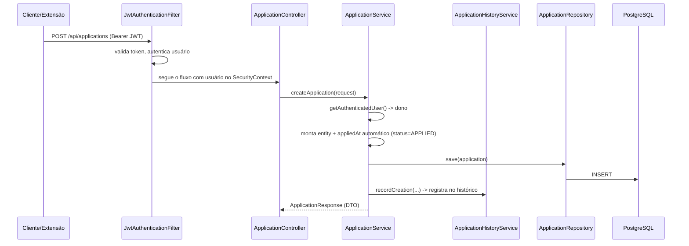

# Relatório técnico — Backend JobTracker (Java)

> Auditoria por leitura do código (nenhum arquivo foi alterado). Módulo: `jobtracker/`.
> Este documento explica **como** o backend funciona, com exemplos concretos, e termina com **o que pode melhorar**.

---

## 1. O que é o projeto (contexto)

Uma API REST para o usuário acompanhar candidaturas a vagas:
- cadastra candidaturas (empresa, cargo, localização, link, plataforma, status);
- guarda **histórico de mudanças de status**;
- se conecta ao **Gmail** (OAuth) para detectar automaticamente o resultado das vagas (entrevista/rejeição/oferta) a partir dos e-mails.

Exemplos de endpoints (todos exigem JWT, exceto `/api/auth/**` e o callback do Gmail):

| Método | Rota | O que faz |
|---|---|---|
| `POST` | `/api/auth/register` | cria conta e devolve JWT |
| `POST` | `/api/auth/login` | autentica e devolve JWT |
| `POST` | `/api/applications` | cria candidatura |
| `GET` | `/api/applications/{id}/history` | histórico de status da candidatura |
| `GET` | `/api/applications/summary` | contagem de candidaturas por status |
| `GET` | `/api/emails?applicationId=` | e-mails sincronizados (com filtro opcional) |
| `POST` | `/api/gmail/sync` | sincroniza e-mails do usuário agora |

---

## 2. Estrutura de pastas e responsabilidade de cada camada

```
src/main/java/jobtracker
├── controller      Ex.: ApplicationController, AuthController  → recebe HTTP, não tem regra
├── dto             Ex.: ApplicationRequest, ApplicationResponse → dados de entrada/saída
├── entity          Ex.: User, Application, Email               → classes do banco (JPA)
├── integration/gmail Ex.: GmailService, EmailParserService     → integração externa + agendamento
├── repository      Ex.: ApplicationRepository                  → acesso a dados (Spring Data)
├── security        Ex.: JwtService, JwtAuthenticationFilter    → autenticação
└── service         Ex.: ApplicationService                      → regra de negócio central
```

**Regra de ouro usada no projeto:** cada camada só chama a de baixo (Controller → Service → Repository). DTO de resposta nunca expõe entidade nem senha.

> Obs.: o `README` do agente e o `BASE` citam pacotes `exception/` e `config/`, mas hoje o tratamento de erro está em `controller/RestExceptionHandler.java` e não existe pacote `config` — a doc está desatualizada.

---

## 3. Principais arquivos — o papel de cada um com exemplo

### `security/JwtService.java` — emite e valida o token
Exemplo real: `JwtService(SecurityConfig :52)` exige secret de **pelo menos 32 bytes** e quebra o startup se não houver:

```java
if (keyBytes.length < 32) {
    throw new IllegalStateException("JWT secret must be at least 32 bytes");
}
```

### `security/JwtAuthenticationFilter.java` — "portaria" de cada requisição
Extrai o `Authorization: Bearer <token>`, valida e coloca o usuário no `SecurityContext` para os controllers identificarem quem é.

### `service/ApplicationService.java` — regra de negócio de candidaturas
Detalhe exemplo: quando o status vira `APPLIED`, preenche `appliedAt` automaticamente:

```java
if (application.getStatus() == ApplicationStatus.APPLIED && application.getAppliedAt() == null) {
    application.setAppliedAt(Instant.now());
}
```

### `integration/gmail/EmailParserService.java` — "traduz" e-mail em candidatura
Exemplo: se o e-mail diz que "não seguiremos com o processo", muda o status da candidatura para `REJECTED`; senão cria a candidatura da empresa com status `APPLIED`.

### `integration/gmail/EncryptionService.java` — protege os tokens OAuth do Gmail
Criptografa os tokens em repouso com **AES-GCM + IV aleatório** (o IV fica no começo do payload).

---

## 4. Fluxo da aplicação — exemplo passo a passo

### 4.1 Login (gera o JWT)

```
POST /api/auth/login
{"email": "ana@exemplo.com", "password": "12345678"}
```
1. `AuthService.login` chama `authenticationManager.authenticate(...)`.
2. `UserDetailsConfig` busca o usuário pelo e-mail; `BCrypt` confere a senha.
3. `JwtService.generateToken(email)` devolve o token.

```
200 OK
{"token": "eyJhbGciOi...", "tokenType": "Bearer", "user": {...}}
```

### 4.2 Criar candidatura (passa pelo filtro seguro)

```
POST /api/applications
Authorization: Bearer eyJhbGciOi...
{"companyName": "Acme", "position": "Backend", "status": "APPLIED"}
```

Fluxo:



Resposta:
```
201 Created
{"id": 1, "companyName": "Acme", "position": "Backend", "status": "APPLIED", "appliedAt": "2026-08-27T..."}
```

---

## 5. Principais decisões arquiteturais e o porquê

| Decisão | Por quê |
|---|---|
| Camadas Controller/Service/Repository | Manter regra fora dos controllers e testável. |
| **DTOs** em vez de expor entidades | Não vazar `password` nem acoplar API ao modelo JPA. |
| **Isolamento por usuário em toda consulta** (`findByIdAndUserId`, `getOwnedApplication(id, userId)`) | Evitar que usuário A leia dados do B (multi-tenant). |
| Parser recebe `User` explícito (overloads `createApplication(request, user)`) | Permitir o **sync agendado do Gmail** rodar em background, sem token HTTP. |
| **Fail-fast de secrets** (JWT ≥32 bytes, chave de criptografia obrigatória) | Erro claro na subida em vez de falha no meio do uso. |
| `appliedAt` automático | Conveniência: a data da candidatura "surge" quando vira `APPLIED`. |
| **Flyway + `ddl-auto=validate`** | Schema versionado; o Hibernate só valida, nunca altera o banco sozinho. |
| Tokens Gmail **criptografados** (AES-GCM) | Obrigação de segurança para credenciais OAuth em repouso. |

---

## 6. Tecnologias e dependências

| Camada | Tecnologia |
|---|---|
| Linguagem | Java 21 |
| Framework | Spring Boot 4.1.1 (Web MVC, Security, Data JPA, Validation, Flyway) |
| Banco | PostgreSQL 16 (prod) · H2 (testes) |
| JWT | jjwt 0.12.6 |
| Gmail | google-api-client 2.8.1 + google-api-services-gmail |
| Docs | springdoc-openapi 3.1.0 (Swagger em `/swagger-ui.html`) |
| Boilerplate | Lombok |
| Infra | Docker multi-estágio (JRE 21, usuário não-root) |

---

## 7. Autenticação e segurança — como o JWT protege cada rota

`SecurityConfig`:

```java
.requestMatchers(HttpMethod.POST, "/api/auth/register", "/api/auth/login").permitAll()
.anyRequest().authenticated()
```

- **Stateless**: nenhuma sessão no servidor; o filtro valida o JWT a cada request.
- Senhas com **BCrypt**.
- `UserDetailsConfig` transforma e-mail → `UserDetails` com `ROLE_<role>`.
- **Gmail**: OAuth `GMAIL_READONLY`, `state` criptografado com o e-mail do usuário, tokens criptografados e com refresh automático.
- **CORS**: liberado para qualquer origem (útil para a extensão e o futuro frontend) — deve ser restringido em produção.

---

## 8. Modelagem do banco e relacionamentos

```mermaid
erDiagram
    USERS ||--o{ APPLICATIONS : "1:N"
    USERS ||--o| GMAIL_CONNECTIONS : "1:1"
    USERS ||--o{ EMAILS : "1:N"
    APPLICATIONS ||--o{ APPLICATION_HISTORY : "1:N"
    APPLICATIONS ||--o{ EMAILS : "1:N"

    USERS { bigint id PK }
    APPLICATIONS { bigint id PK, bigint user_id FK, varchar company_name, varchar position, varchar status }
    APPLICATION_HISTORY { bigint id PK, bigint application_id FK, bigint changed_by_user_id FK, varchar new_status }
    GMAIL_CONNECTIONS { bigint id PK, bigint user_id FK unique }
    EMAILS { bigint id PK, bigint user_id FK, bigint application_id FK, varchar message_id }
```

Pontos-chave:
- `emails.message_id` + índice `(message_id, user_id)` evita **e-mails duplicados** na sincronização.
- `user_id` com `ON DELETE CASCADE` (apagar usuário remove dados dele).
- `application_history.changed_by_user_id` com `ON DELETE SET NULL` (preserva o histórico mesmo se o autor sair).
- Timestamps (`created_at`/`updated_at`) preenchidos via `@PrePersist`/`@PreUpdate` nas entidades.

---

## 9. Pontos positivos, problemas e melhorias

### ✅ Pontos fortes
- Camadas limpas e consistentes; **DTO em tudo**, nunca entidade/senha.
- **Isolamento por usuário** em histórico, e-mails e resumo — testado.
- **Fail-fast** de secrets e Flyway `validate` (ambiente não quebra silenciosamente).
- Sync Gmail **agendado** desacoplado do contexto HTTP.
- **26 testes verdes**: auth, CRUD, isolamento, Gmail (mockado), parser (unitário).

### ⚠️ Problemas (com impacto e onde corrigir)

| # | Problema | Impacto | Onde corrigir |
|---|---|---|---|
| 1 | `AuthService` usa `jakarta.transaction.Transactional`; o resto usa `org.springframework.transaction.annotation.Transactional` | Inconsistência/confusão de imports | `AuthService.java` |
| 2 | Erro de validação (ex.: campo vazio) retorna JSON do Spring; `404` do handler retorna outro formato | Cliente não sabe interpretar erro de forma uniforme | `RestExceptionHandler` |
| 3 | Regex de `parsePosition` é **gulosa**: "Vaga de Backend aberta..." vira `position = "Backend aberta..."` | Candidaturas auto-criadas com cargo errado | `EmailParserService.parsePosition` |
| 4 | `raw_content` (`VARCHAR 5000`) pode **truncar e-mail longo** | Dados de parsing incompletos | migration `emails` |
| 5 | Listagens sem paginação (`List<>`) | Fica lento com muitos registros | `ApplicationController`/`EmailController` |
| 6 | `UserService.updateUser` existe, mas **nenhum endpoint usa**; `Role.ADMIN` nunca é usado | Código morto / feature incompleta | `UserController` |
| 7 | `JwtAuthenticationFilter` engole exceção sem log | Token expirado vira 401 "mudo", difícil de debugar | `JwtAuthenticationFilter` |
| 8 | `UserController.getMyProfile` monta 401 manualmente com `ResponseEntity.status(401)` | Saída fora do padrão do restante da API | `UserController` |

### 🚀 Melhorias sugeridas (em ordem de prioridade)
1. Padronizar erro global: um `@RestControllerAdvice` que devolva sempre `{ error, message }` para validação, 404, 401/409 e violação de banco.
2. Corrigir a regex de `parsePosition` (parar no primeiro separador, ex.: `.`/`,`/` –`).
3. Paginar `GET /api/applications` e `GET /api/emails` com `Pageable`.
4. Aumentar/alterar `raw_content` (ex.: `TEXT`) para não truncar.
5. Logar falha de token no filtro JWT e desligar Swagger em produção (`springdoc.api-docs.enabled=false`).
6. Restringir CORS a origens conhecidas em produção; adicionar health check (Actuator) e CI (GitHub Actions).
7. Consolidar a documentação (`BASE`/`README` do agente) com a estrutura real do código.